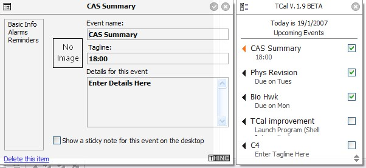



## Calendar or Task keeper TCal 1\.9

### Description

Keeps track of your undone tasks. A bit like a mac interface: transparency, fading and all that is present. And after you fixing a bit of code, you should have for yourself a good calendar program!

This program utilizes the INI feature and gets information only from the INI, so MS office or any MDB feature is not needed.

Extra features include showing of multiple sticky notes (its a checkbox saying "show sticky for this entry"), stay on top, contractable form size, animated details...

Credits to some date picker object which is disabled by the code by default, and the fader by some famous guy in PSC...fading is nice.

Oh and it shows shadow under forms as well.

Note: the alarm function does not work at the moment. if you have a solution to making a string to a date please post a comment.
 
### More Info
 

             |
---                |---
**Submitted On**   |2006-12-21 18:30:52
**By**             |[Brian Lai](https://github.com/Planet-Source-Code/PSCIndex/blob/master/ByAuthor/brian-lai.md)
**Level**          |Beginner
**User Rating**    |5.0 (15 globes from 3 users)
**Compatibility**  |VB 6\.0
**Category**       |[String Manipulation](https://github.com/Planet-Source-Code/PSCIndex/blob/master/ByCategory/string-manipulation__1-5.md)
**World**          |[Visual Basic](https://github.com/Planet-Source-Code/PSCIndex/blob/master/ByWorld/visual-basic.md)
**Archive File**   |[Calendar\_o2043231182007\.zip](https://github.com/Planet-Source-Code/brian-lai-calendar-or-task-keeper-tcal-1-9__1-67665/archive/master.zip)

### API Declarations

See Code

